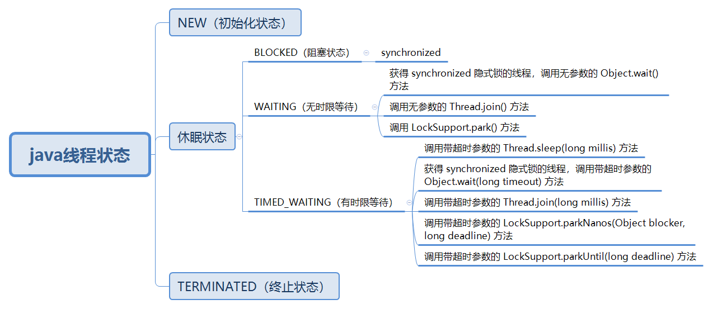

# Thread

## 一.基本概念

### 1.生命周期

#### 通用线程生命周期：

​	

#### java线程生命周期：

#### java线程状态：

***ps:stop(),suspend(),resume()废弃，stop()改为interrupt()***

### 2.线程数

​	并发的目的：提高性能=降低延迟+提高吞吐量=算法优化+提高硬件利用率

​	硬件利用率=I/O+CPU综合利用率 ，并发整合I/O和CPU资源

CPU密集型：线程数=核数+1

I/O密集型：核数*(1+I/O耗时/CPU耗时)

### 3.锁

**系统级锁**需要进行内核态到用户态切换，切换主要耗时在：

1. 保存/恢复线程
2. 检查
3. 在不同用户程序间切换的话，那么还要更新cr3寄存器，这样会更换每个程序的虚拟内存到物理内存映射表的地址

引用：https://blog.csdn.net/JH_Zhai/article/details/79861169

1.锁的分类

资料：https://www.jianshu.com/p/68587af2264b

## 二.线程池

2.线程互斥

3.线程协作

4.并发设计模式

### 三.原子类	CPU提供CAS(compare and swap)指令

只针对***1个***共享变量，多个共享变量使用互斥锁

CAS原子指令：读值-比较-写入/什么都不做

原子类操作实现：CAS+自旋

​	问题：ABA问题，饥饿，活锁

​	解决方案：版本号 AtomicStampedReference，bool标志 AtomicMarkableReference
